# 实验二：图书管理系统用例建模
| 学号 | 姓名| 班级 |
|:---:|:---:|:---:|
|201510414315   |   王仕宣    |      软工三班|

## 图书管理系统的用例关系图

### 用例图PlantUML源码如下：
```
@startuml
left to right direction
:读者:
:系统管理员:
:图书管理员:
rectangle    {
(查询图书)<-- 图书管理员
(管理员登录)<--图书管理员
(借出图书)<|--(管理员登录)
(归还图书)<|--(管理员登录)
(维护读者信息)<|--(管理员登录)
系统管理员-->(添加新图书)
系统管理员-->(删除过期图书)
系统管理员 -->(修改馆藏图书)
(读者登录) <--读者
(查询图书)<--读者
(查看账户信息)<|--(读者登录)
(预定图书)<|--(读者登录)
(续借图书)<|--(读者登录)
}
@enduml
```
### 用例图如下：

## 参与者说明：

### 图书管理员

主要职责是：图书管理员主要是通过严格按照规则执行借出图书，归还图书，维护读者信息等行为为广大的读者提供便利，更好的管理图书与读者之间的联系。

### 读者

主要职责是：读者可通过图书管理员以及相关平台来续借图书，预定图书等，读者应该遵循相关的图书借阅规则，做到文明借阅图书。

### 系统管理员

主要职责是：系统管理员主要负责图书的日常维护工作，包括图书入库与出库。

## 用例规约表
### “借出图书”用例
|用例名称 | 借出图书|
|:----|:----|
| 参与者 | 图书管理员（主要参与者）、读者（次要参与者）|
|前置条件|图书管理员已被识别和授权|
|后置条件|储存借书记录，更新库存数量，所借图书状态为借出|
|主事件流|
|参与者动作|系统行为|
|1.图书管理员将读者借书卡提供给系统；<br>3.图书管理员将读者所借图书输入系统；<br>6.重复3—5，直到图书管理员确认全部书籍登记完毕；<br>|2.系统验证读者身份和借书条件<br>4.系统记录结束信息，并且修改图书状态和此种书的可借数量；<br>5.系统累加读者的借书数量；<br>7.系统打印借书清单，交易成功完成|
|备选事件流|2a.非法读者<br>&nbsp;&nbsp;1.系统提示错误并拒绝接受输入<br>2b.读者借书数已达限额<br>&nbsp;&nbsp;1.系统提示错误并拒绝接受输入<br>5a.读者借书数已达限额<br>&nbsp;&nbsp;1.系统提示，并要求结束输入<br>&nbsp;&nbsp;2.图书管理员确认借书完成<br>5b.读者有该书的预定记录<br>&nbsp;&nbsp;1.删除该书的预订信息|
|业务规则|
|1.未归还的图书不可借出；<br>2.一次性最多可借阅30本图书|
### “借出图书”流程图源码
```
@startuml
|读者|
start
:提供读者信息;
|#AntiqueWhite|图书管理员|
:图书管理员验证读者信息;
if (该读者存在且可借 ) then (yes)
  :更新借书信息;
else (no)
  :提示读者不存在或不满足借书条件;
endif
stop
@enduml
```
### “借出图书”流程图
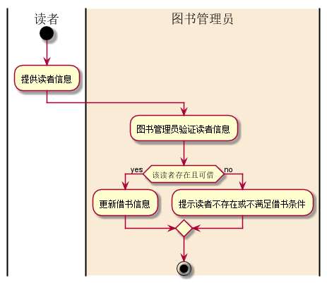
### “归还图书”用例
|用例名称 | 归还图书|
|:----|:----|
| 参与者 | 图书管理员（主要参与者）、读者（次要参与者）|
|前置条件|图书管理员已被识别和授权|
|后置条件|修改借书书记录，更新库存数量，所借图书状态为可借出|
|主事件流|
|参与者动作|系统行为|
|1.图书管理员将读者借书卡提供给系统；<br>3.图书管理员将读者所还图书输入系统；<br>6.重复3—5，直到图书管理员确认全部书籍登记完毕；<br>|2.系统验证读者身份和还书条件<br>4.系统记录结束信息，并且修改图书状态和此种书的可借数量；<br>5.系统累加读者的还书数量；<br>7.系统打印还书清单，交易成功完成|
|备选事件流|2a.非法读者<br>&nbsp;&nbsp;1.系统提示错误并拒绝接受输入<br>2b.读者未借此本书<br>&nbsp;&nbsp;1.系统提示错误并拒绝接受输入<br>5a.读者有该书的续借记录<br>&nbsp;&nbsp;1.删除该书的续借信息|
|业务规则|
|1.归还超期，读者应缴纳相应的罚款；<br>2.损坏的图书应该赔偿|
### “归还图书”流程图源码
```
@startuml
|读者|
start
:提供读者信息;
|#AntiqueWhite|图书管理员|
:图书管理员验证读者信息;
if (该读者存在 ) then (no)
else(yes)
  if(图书未损坏且未超期) then (yes)
     :更新还书信息;
  else(no)
  endif
endif
stop
@enduml
```
### “归还图书”流程图
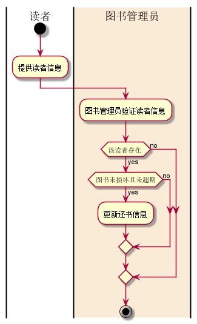
### “维护读者信息”用例
|用例名称|维护读者信息|
|:----|:----|
| 参与者 | 图书管理员|
|前置条件|图书管理员已被识别和授权|
|后置条件|对读者信息进行增删改除|
|主事件流|
|参与者动作|系统行为|
|1.图书管理员登录系统；<br>3.图书管理员输入读者账号；<br>5.图书管理员修改读者信息（包括增删改）；<br>|2.系统验证图书管理员身份；<br>4.系统筛选出读者信息并显示；<br>6.系统保存修改后的读者信息并保存|
|备选事件流|2a.非法图书管理员<br>&nbsp;&nbsp;1.系统提示错误并拒绝接受输入<br>4a.非法读者<br>&nbsp;&nbsp;1.系统提示错误并拒绝接受输入|
|业务规则|
|1.应输入正确的读者账号信息，才可进行删改操作；<br>2.可通过增加添加读者|
### “维护读者信息”流程图源码
```
@startuml
start
if ( 该读者存在 ) then (yes)
  :维护读者信息（増删改);
else (no)
  :提示该读者不存在 ;
endif
stop
@enduml
```
### “维护读者信息”流程图
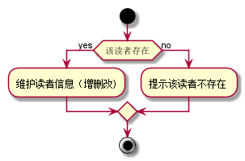
### “查询图书”用例
|用例名称|查询图书|
|:----|:----|
|参与者|读者（主要参与者）、图书管理员（次要参与者）|
|前置条件|图书管理员和读者已被识别和授权|
|后置条件|根据书名或者ISBN查询图书|
|主事件流|
|参与者动作|系统行为|
|1.图书管理员或者读者根据书名或者ISBN两种不同的搜索方式查询<br>|2.系统显示搜索的结果|
|备选事件流|2a.图书不存在<br>&nbsp;&nbsp;1.系统提示所查询的书不存在|
|业务规则|
|1.查询图书应该遵循正确的查询方式|
### “查询图书”流程图源码
```
@startuml
start
if ( 图书存在 ) then (yes)
  :显示图书信息;
else (no)
  :提示该图书不存在 ;
endif
stop
@enduml
```
### “查询图书”流程图
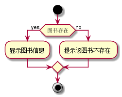
### “管理员登录”用例
|用例名称|管理员登录|
|:----|:----|
|参与者|图书管理员|
|前置条件|存在该图书管理员|
|后置条件|借书，还书，维护读者信息|
|主事件流|
|参与者动作|系统行为|
|1.图书管理员将账号信息提供给系统|2.系统验证图书管理员身份<br>3.系统显示图书管理员页面|
|备选事件流|2a.非法图书管理员<br>&nbsp;&nbsp;1.系统提示不存在该图书管理员，请重新输入|
|业务规则|
|1.管理员账号存在才能登录|
### “管理员登录”流程图源码
```
@startuml
start
if ( 该图书管理员存在 ) then (yes)
  :管理员登录;
else (no)
  :提示该图书管理员不存在 ;
endif
stop
@enduml
```
### “管理员登录”流程图
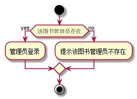
### “修改馆藏图书”用例
|用例名称|修改馆藏图书|
|:----|:----|
|参与者|系统管理员|
|前置条件|系统管理员已存在|
|后置条件|修改馆藏图书信息|
|主事件流|
|参与者动作|系统行为|
|1.系统管理员将账号信息提供给系统；<br>3.系统管理员将图书ISBN提供给系统；<br>5.系统管理员修改图书相关信息|2.系统验证系统管理员身份；<br>4.系统验证图书是否存在；<br>6.系统更新图书相关信息|
|备选事件流|2a.非法系统管理员<br>&nbsp;&nbsp;1.系统提示该系统管理员不存在，请重新输入<br>4a.非法图书<br>&nbsp;&nbsp;1.系统提示该图书不存在|
|业务规则|
|1.系统管理员必须存在才可以执行该操作；<br>2.不存在的图书无法修改
### “修改馆藏图书”流程图源码
```
@startuml
 start
 if ( 此书存在) then (yes)
   :修改书籍信息;
 else (no)
   :提示该书籍不存在;
 endif
 stop
@enduml
```
### “修改馆藏图书”流程图
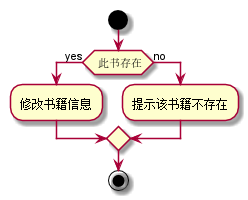
### “添加新图书”用例
|用例名称|添加新图书|
|:----|:----|
|参与者|系统管理员|
|前置条件|系统管理员已存在|
|后置条件|更新库存数量|
|主事件流|
|参与者动作|系统行为|
|1.系统管理员将账号信息提供给系统；<br>3.系统管理员将图书ISBN提供给系统；<br>5.系统管理员将要添加的书籍信息提供给系统|2.系统验证系统管理员身份；<br>4.系统显示书籍添加页面；<br>6.系统更新书籍信息|
|备选事件流|2a.非法系统管理员<br>&nbsp;&nbsp;1.系统提示该系统管理员不存在，请重新输入<br>6a.书籍已存在<br>&nbsp;&nbsp;1.系统提示该图书已存在，请修改库存量|
|业务规则|
|1.系统管理员必须存在才可以执行该操作；<br>2.要添加的图书存在，修改库存数量即可|
### “添加新图书”流程图源码
```
@startuml
start
if ( 此书已存在) then (yes)
  :修改库存数量;
else (no)
  :添加书籍信息 ;
endif
stop
@enduml
```
### “添加新图书”流程图
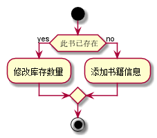
### “删除过期图书”用例
|用例名称|删除过期图书|
|:----|:----|
|参与者|系统管理员|
|前置条件|系统管理员已存在|
|后置条件|更新库存数量|
|主事件流|
|参与者动作|系统行为|
|1.系统管理员将账号信息提供给系统；<br>3.系统管理员将图书ISBN提供给系统；<br>5.系统管理员将要删除的书籍信息提供给系统|2.系统验证系统管理员身份；<br>4.系统显示书籍删除页面；<br>6.系统更新书籍信息|
|备选事件流|2a.非法系统管理员<br>&nbsp;&nbsp;1.系统提示该系统管理员不存在，请重新输入<br>6a.书籍不存在<br>&nbsp;&nbsp;1.系统提示该图书不存在|
|业务规则|
|1.系统管理员必须存在才可以执行该操作；<br>2.要添加的图书不存在，不可添加|
### “删除过期图书”流程图源码
```
@startuml
 start
 if ( 此书存在) then (yes)
   :删除书籍信息，修改库存数量;
 else (no)
   :提示该书籍不存在;
 endif
 stop
@enduml
```
### “删除过期图书”流程图
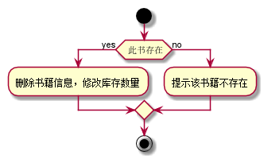
### “读者登录”用例
|用例名称|读者登录|
|:----|:----|
|参与者|读者|
|前置条件|读者已存在|
|后置条件|续借，预定，查看账户信息等操作|
|主事件流|
|参与者动作|系统行为|
|1.读者将账号信息提供给系统<br>|2.系统验证读者身份；<br>3.系统显示读者信息|
|备选事件流|2a.非法读者<br>&nbsp;&nbsp;1.系统提示该读者不存在，请重新输入|
|业务规则|
|1.读者存在才可以进行登录操作|
### “读者登录”流程图源码
```
@startuml
start
if ( 该读者存在 ) then (yes)
  :读者登录;
else (no)
  :提示该读者不存在 ;
endif
stop
@enduml
```
### “读者登录”流程图
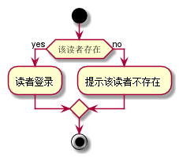
### “续借图书”用例
|用例名称|续借图书|
|:----|:----|
|参与者|读者|
|前置条件|读者已被识别和授权|
|后置条件|储存借书记录，更新库存数量，所借图书状态为借出|
|主事件流|
|参与者动作|系统行为|
|1.读者将账号信息提供给系统<br>3.读者选择续借图书|2.系统验证读者身份；4.系统记录借书状态，并且修改图书的状态和此种书的可借数量；5.系统累加读者的借书数量|
|备选事件流|2a.非法读者<br>&nbsp;&nbsp;1.系统提示该读者不存在，请重新输入|
|业务规则|
|1.读者存在，并且登录后才可以进行续借操作<br>2.只有已经借了此书，才能续借|
### “续借图书”流程图源码
```
@startuml
start
if ( 此书借并还没归还  ) then (yes)
  :续借操作;
else (no)
  :提示你未借此书 ;
endif
stop
@enduml
```
### “续借图书”流程图
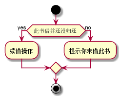
### “预定图书”用例
|用例名称|预定图书|
|:----|:----|
|参与者|读者|
|前置条件|读者以被识别和授权|
|后置条件|储存预定记录，更新库存数量，所预订图书的状态为已预定|
|主事件流|
|参与者动作|系统行为|
|1.读者将账号信息提供给系统<br>3.读者选择预订图书|2.系统验证读者身份；<br>4.系统记录预订状态，更新库存数量，并且修改图书的状态；|
|备选事件流|2a.非法读者<br>&nbsp;&nbsp;1.系统提示该读者不存在，请重新输入<br>4a.非法预定<br>&nbsp;&nbsp;1.系统提示要预定的图书不存在，请重新选择|
|业务规则|
|1.读者存在，并且登录后才可以进行预订操作<br>2.不存在的图书不能预定|
### “预定图书”流程图源码
```
|@startuml
 start
 if ( 图书存在且可借 ) then (yes)
   :预订操作，更新图书预定信息;
 else (no)
   : 图书不存在或不可借;
 endif
 stop
 @enduml
 ```
### “预定图书”流程图
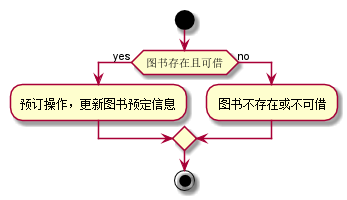
### “查看账户信息”用例
|用例名称|查看帐户信息|
|:----|:----|
|参与者|读者|
前置条件|读者以被识别和授权|
|后置条件|查看帐户信息，可借阅数量等|
|主事件流|
|参与者动作|系统行为|
|1.读者将账号信息提供给系统<br>|2.系统验证读者身份；<br>3.系统显示账户信息|
|备选事件流|2a.非法读者<br>&nbsp;&nbsp;1.系统提示该读者不存在，请重新输入|
|业务规则|
|1.读者存在，并且登录后才可以进行查看账户操作|
### “查看账户信息”流程图源码
 ```
@startuml
start
if ( 读者存在 ) then (yes)
  :显示读者信息;
else (no)
  :提示该读者不存在 ;
endif
stop
@enduml
 ```
### “查看账户信息”流程图
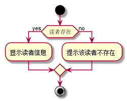

