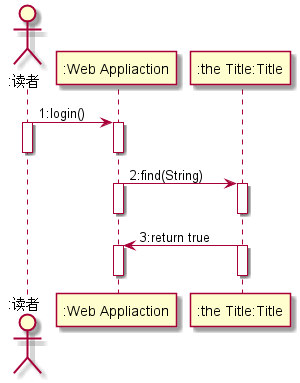
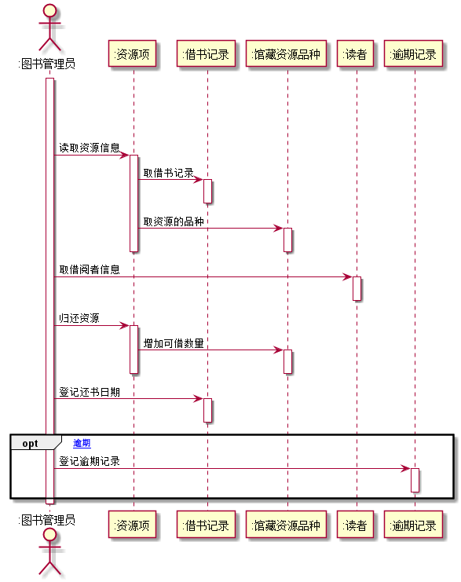
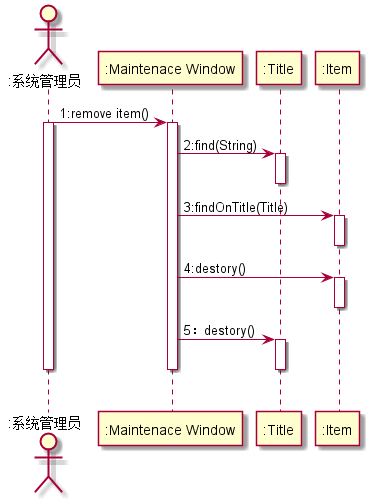

# 实验4：图书管理系统顺序图绘制
|学号|班级|姓名|
|:----:|:----:|:----:|
|201510414315|软件（本）15-3|王仕宣|
## 图书管理系统的顺序图
### 1 借书用例
#### 1.1 借书用例PlantUML源码
```
@startuml
skinparam roundcorner 20
skinparam maxmessagesize 60
skinparam sequenceParticipant underline
actor ":图书管理员" as A
participant ":读者" as B
participant ":资源项" as C
participant ":馆藏资源品种" as D
participant ":借书记录" as E
|||
|||
activate A
A->B:验证读者
activate B
deactivate B
A->B:取作者限额
activate B
deactivate B
loop
A->C:获取资源项
activate C
C->D: 查找资源品种
activate D
deactivate D
deactivate C
A->E:创建借书记录
activate E
deactivate E
A->C:借出资源
activate C
C->D:减少可借数量
activate D
deactivate D
deactivate C
A->B:减少可用限额
activate B
end
deactivate B
A->E:打印借书清单
activate E
deactivate E
|||
|||
@enduml
```
#### 1.2 借书用例顺序图

#### 1.3 借书用例顺序图说明
&nbsp;&nbsp;&nbsp;&nbsp;&nbsp;借书用例的参与者有：图书管理员、读者、资源项、馆藏资源品种、借书记录。<br>
主要包括三个步骤：首先验证读者的借书条件，其次验证所借书的可借性，最后打<br>印借书清单。
### 2 还书用例
#### 2.1 还书用例PlantUML源码
```
@startuml
actor ":图书管理员" as A
participant ":资源项" as B
participant ":借书记录" as C
participant ":馆藏资源品种" as D
participant ":读者" as E
participant ":逾期记录" as F
|||
|||
|||
activate A
A->B:读取资源信息
activate B
B->C:取借书记录
activate C
deactivate C
B->D:取资源的品种
activate D
deactivate D
deactivate B
A->E:取借阅者信息
activate E
deactivate E
A->B:归还资源
activate B
B->D:增加可借数量
activate D
deactivate D
deactivate B
A->C:登记还书日期
activate C
deactivate C
opt [逾期]
A->F:登记逾期记录
activate F
deactivate F
end
deactivate A
@enduml
```
#### 2.2 还书用例顺序图

#### 2.3 还书用例顺序图说明
&nbsp;&nbsp;&nbsp;&nbsp;&nbsp;还书记录的参与者包括：图书管理员、资源项目、借书记录，馆藏资源品种、读者、逾期记录。
主要步骤：首先，验证还书条件，其次是还书，最后是处理逾期问题。
### 3 预定用例
#### 3.1 预定用例PlantUML源码
```
@startuml
actor ":读者" as A
participant ":Web Appliaction" as B
participant ":the Title:Title" as C
A->B:1:login()
activate A
activate B
deactivate B
deactivate A
B->C:2:find(String)
activate B
activate C
deactivate C
deactivate B
C->B:3:return true
activate C
activate B
deactivate B
deactivate C
@enduml
```
#### 3.2 预定用例顺序图

#### 3.3 预定用例顺序图说明
说明：<br>
(1)Login:登陆系统的函数。<br>
(2)find(String):查找相应书目的函数。<br>
(3)reserve():预定书籍的函数。<br>
### 4 增加图书用例
#### 4.1 增加图书用例PlantUML源码
```
@startuml
 actor ":系统管理员" as A
 participant ":Maintenace Window" as B
 participant ":Title" as C
 participant ":Item" as D
 A->B:1:add item()
 activate A
 activate B
 B->C:2:find(String)
 activate C
 C->B:3:return true
 deactivate C
 deactivate B
 B->D:4:create(Integer,Title)
 activate B
 activate D
 deactivate D
 deactivate B
 deactivate A
 |||
 |||
@enduml
```
#### 4.2 增加图书用例顺序图

#### 4.3 增加图书用例顺序图说明
说明：<br>
(1)addItem():添加书籍函数。<br>
(2)find(String):根据书籍查找相应书目的函数。<br>
(3)create(integer,Title):修改书籍数目的函数。<br>
### 5 删除图书用例
#### 5.1 删除图书用例PlantUML源码
```
@startuml
actor ":系统管理员" as A
participant ":Maintenace Window" as B
participant ":Title" as C
participant ":Item" as D
A->B:1:remove item()
activate A
activate B
B->C:2:find(String)
activate C
deactivate C
B->D:3:findOnTitle(Title)
activate D
deactivate D
B->D:4:destory()
activate D
deactivate D
B->C:5：destory()
activate C
deactivate C
deactivate B
deactivate A
|||
@enduml
```
#### 5.2 删除图书用例顺序图

#### 5.3 删除图书用例顺序图说明
说明：<br>
(1)find(String):书目类的查找函数。<br>
(2)findOnTitle(Title):查找此书目下书籍信息的函数。<br>
(3)destory():删除书籍信息的函数。<br>
(4)destory():删除书目信息的函数。<br>


