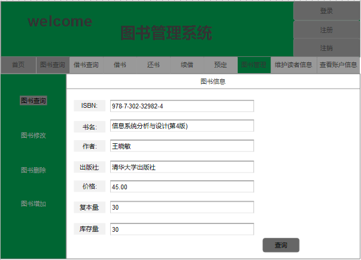

# 实验5：图书管理系统数据库设计与界面设计
|学号|班级|姓名|
|:----:|:----:|:----:|
|201510414315|软件（本）15-3|王仕宣|
## 1 数据库表设计
### 1.1 读者表
|字段|类型|主键，外键|可以为空|默认值|约束|说明|
|:----:|:----:|:----:|:----:|:----:|:----:|:----:|
|readerId|varchar(12)|主键|否||||
|readerName|varchar(30)||否||||
|readerPassword|vahrchar(20)||否||||
|maxBook|int||否|||图书限额|
|lendBook|int||否|||已借图书量|
|maxDisc|int||否|||碟片限额|
|lendDisc|int||否|||可借碟片数量|
### 1.2 图书管理员表
|字段|类型|主键，外键|可以为空|默认值|约束|说明|
|:----:|:----:|:----:|:----:|:----:|:----:|:----:|
|adminId|varchar(12)|主键|否||||
|adminName|varchar(30)||否||||
|adminPassword|varchar(20)||否||||

### 1.3 系统管理员表
|字段|类型|主键，外键|可以为空|默认值|约束|说明|
|:----:|:----:|:----:|:----:|:----:|:----:|:----:|
|systemadminId|varchar(8)|主键|否||||
|systemadminPassword|varchar(20)||否||||
### 1.4 图书品种表
|字段|类型|主键，外键|可以为空|默认值|约束|说明|
|:----:|:----:|:----:|:----:|:----:|:----:|:----:|
|ISBN|varchar(20)|主键|否||||
|bookName|varchar(40)||否||||
|author|varchar(8)||否|||作者|
|publisher|varchar(20)||否|||出版社|
|price|float||否|||价格|
|cnum|int||否|||复本量|
|snum|int||否|||库存量|
### 1.5 借书记录表
|字段|类型|主键，外键|可以为空|默认值|约束|说明|
|:----:|:----:|:----:|:----:|:----:|:----:|:----:|
|bookId|varchar(20)|主键|否||||
|readerId|varchar(12)|外键|否|||学号|
|ISBN|varchar(20)|外键|否||||
|LTime|datetime||否|||借书日期|
|RTime|datetime||否|||应还日期|
|FactRTime|datetime||否|||归还日期|
### 1.6 预定记录表
|字段|类型|主键，外键|可以为空|默认值|约束|说明|
|:----:|:----:|:----:|:----:|:----:|:----:|:----:|
|reserveId|varchar(10)|主键|否||||
|readerId|varchar(12)|外键|否||||
|ISBN|vrchar(20)|外键|否||||
|reserveTime|datetime||否|||||预定日期|
### 1.7 续借记录表
|字段|类型|主键，外键|可以为空|默认值|约束|说明|
|:----:|:----:|:----:|:----:|:----:|:----:|:----:|
|renewId|varchar(10)|主键|否||||
|readerId|varchar(12)|外键|否||||
|ISBN|vrchar(20)|外键|否||||
|renewTime|datetime||否|||||续借日期|
## 2 界面设计
### 2.1  界面设计

* 用例图参见：图书管理用例
* 类图参见：图书类
* 顺序图参见：图书顺序图
* API接口如下：
1.图书查询
* 功能：用于指定图书的查询
* 请求地址：http://localhost:8080/Library/book/xxx
* 请求方法：POST
* 请求参数：ISBN

|参数名称|必填|说明|
|:----:|:----:|:----:|
|ISBN|是|用于查询指定的图书|
|method|是|POST|
* 返回实例：
```
{
     "code":200,
     "data":{
             "ISBN":"978-7-302-32982-4",
             "bookName":"信息系统分析与设计(第4版)",
             "author":"王晓敏",
             "publisher":"清华大学出版社",
             "price":45.00,
             "cnum":30,
             "snum":30,
             },
             "msg":"响应成功"
 }
```
* 返回参数说明：

|参数名称|说明|
|:----:|:----:|
|msg|请求响应结果|
|data|图书信息|
|code|返回码|
2.图书删除
* 功能：用于指定图书的删除
* 请求地址：http://localhost:8080/Library/book/xxx
* 请求方法：POST
* 请求参数：ISBN

|参数名称|必填|说明|
|:----:|:----:|:----:|
|ISBN|是|用于删除指定的图书|
|method|是|POST|
* 返回实例：
```
{
     "code":200,
     "data":{
             "flag":true,
             },
             "msg":"响应成功"
 }
```
* 返回参数说明：

|参数名称|说明|
|:----:|:----:|
|msg|请求响应结果|
|data|图书信息|
|code|返回码|
|flag|图书是否删除成功|
3.图书修改
* 功能：用于指定图书的修改
* 请求地址：http://localhost:8080/Library/book/xxx
* 请求方法：POST
* 请求参数：book(javabean)

|参数名称|必填|说明|
|:----:|:----:|:----:|
|book|是|图书类对象|
|method|是|POST|
* 返回实例：
```
{
     "code":200,
     "data":{
             "ISBN":"978-7-302-32982-4",
             "bookName":"信息系统分析与设计(第4版)",
             "author":"王晓敏",
             "publisher":"清华大学出版社",
             "price":45.00,
             "cnum":30,
             "snum":30,
             "flag":true,
             },
             "msg":"响应成功"
 }
```
* 返回参数说明：

|参数名称|说明|
|:----:|:----:|
|msg|请求响应结果|
|data|图书信息|
|code|返回码|
|flag|图书是否修改成功|

4.图书增加
* 功能：用于指定图书的增加
* 请求地址：http://localhost:8080/Library/book/xxx
* 请求方法：POST
* 请求参数：book(javabean)

|参数名称|必填|说明|
|:----:|:----:|:----:|
|book|是|图书类对象|
|method|是|POST|
* 返回实例：
```
{
     "code":200,
     "data":{
             "ISBN":"978-7-302-32982-4",
             "bookName":"信息系统分析与设计(第4版)",
             "author":"王晓敏",
             "publisher":"清华大学出版社",
             "price":45.00,
             "cnum":30,
             "snum":30,
             “flag":true,
             },
             "msg":"响应成功"
 }
```
* 返回参数说明：

|参数名称|说明|
|:----:|:----:|
|msg|请求响应结果|
|data|图书信息|
|code|返回码|
|flag|图书是否添加成功|

