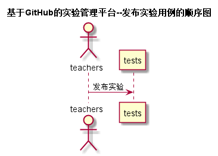

<!-- markdownlint-disable MD033-->
<!-- 禁止MD033类型的警告 https://www.npmjs.com/package/markdownlint -->

# “发布实验”用例 [返回](../README.md)
## 1. 用例规约

|用例名称|发布实验|
|-------|:-------------|
|功能|发布相关课程的实验|
|参与者|老师|
|前置条件|必须先登录，以及已经选择课程|
|后置条件||
|主事件流| 1.用户填写实验名称以及GitHub地址  2.用户提交发布信息 |
|备选事件流|1a. 用户实验名称或者GitHub没有填写  &nbsp;&nbsp; 1.系统提示实验名称或者GitHub为空   &nbsp;&nbsp; 2. 用户重新填写并提交。 |

## 2. 业务流程
 [源码](../src/sequence发布实验puml)

## 3. 界面设计
- 界面参照: https://wsx119.github.io/is_analysis/test6/ui/发布实验.html
- API接口调用
    - 接口1：[setPassword](../接口/uploadTests.md)

## 4. 算法描述
   无

## 5. 参照表
tests
- [TESTS](../数据库设计.md/TESTS)
